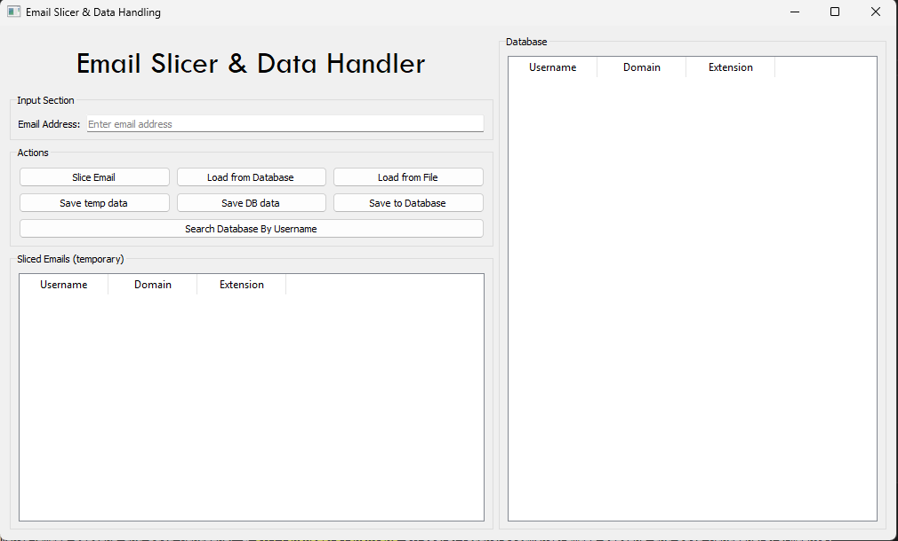
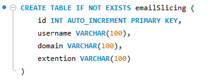
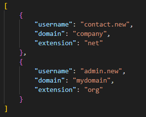
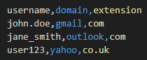
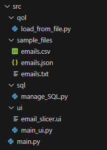

# Email Slicer and Data Handler
A python GUI Application to slice email addresses into `username`, `domain`, `extension` easily and save them to a desired format.
(UI was built using **Qt Designer**)

## Features
- Slice emails into components : `username`, `domain`, `extension`
- Import emails from :
    - CSV
    - JSON
    - TXT
- Export sliced emails as :
    - CSV
    - JSON
- Temperorary store and view emails before saving in a dedicated table
- Save data to and load from local mySQL database
- Search database by username

## GUI Preview

## Database Functionality
With the program, you can store and retrieve data using a MySQL Database.
- Sliced and imported data are appended to the temperory table which can be entered into the database with the `Save to Database` button in GUI
- You may search for a particular email by username in the loaded database with the `Search Database By Username` button in GUI
- Loaded database data may be saved to a `.csv` or `.json` file. Similarly with the temperory table.

### Database Requirements
- Database System - `MySQL`
- Default Database Name - `emailSlicing` (changeable)
- Table Schema - (created if does not exist)

## Required libraries
- Standard libraries
    - `sys`
    - `pathlib.Path`
    - `csv`
    - `json`
- Third-Party libraries
    - `PyQt5`
    - `MySQL Connector`

PyQt5 and or MySQL Connector may be installed with following commands -
- `pip install PyQt5`
- `pip install mysql-connector-python`

## Import and Export format
JSON and CSV are meant for importing email data which is already split
whereas TXT is meant for importing email data to be splitted
### TXT
Imported txt data must contain emails seperated by end line character
### JSON

Imported json data must be an array of objects with the keys `username`, `domain`, `extension`
Output json data will be in the same format as in attached image
### CSV

Imported csv data must be composed of a header row with columns `username`, `domain`, `extension`
Output csv data will be in the same format as in attached image

## Project Structure

## Flow of control
.png)